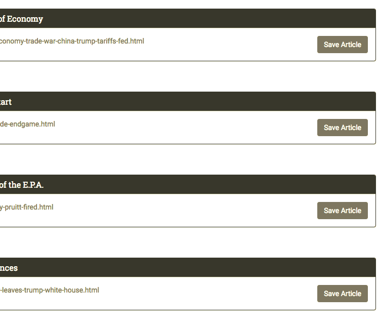
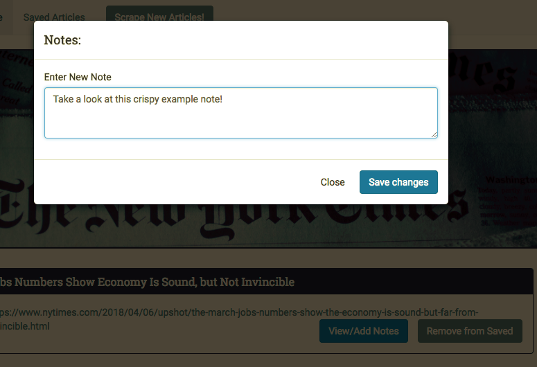

# All the News That's Fit to Scrape

A web app that lets users view and leave comments on the latest news stories scraped from The New York Times using Mongoose and Cheerio.

## Getting Started
https://serene-lake-33984.herokuapp.com/

## Screen Shots

## Scrape Articles from The New York Times


## Save Articles


## Leave a Comment


## Prerequisites

```
- Node.js - Download the latest version of Node https://nodejs.org/en/
```

## Technologies used
- body-parager NPM Package - https://www.npmjs.com/package/inquirer
- express NPM Package - https://www.npmjs.com/package/express
- path NPM Package - https://www.npmjs.com/package/path
- cheerio - https://www.npmjs.com/package/cheerio
- express - https://www.npmjs.com/package/express
- express-handlebars - https://www.npmjs.com/package/express-handlebars
- mongoose - https://www.npmjs.com/package/mongoose
- request - https://www.npmjs.com/package/request

## Built With

* VS Code  - Text Editor

## Authors

* **Sonny Hughes** - *HTML/JS/Node.js* - [Sonny Hughes](https://github.com/sonnyhughes)